### Ongoing projects

- [qoi.js](https://github.com/RickyC0626/qoi.js): QOI codec written in JavaScript
- [NEO Dashboard](https://github.com/rickyc0626/neo-dashboard): A SpaceX-themed dashboard for displaying near-Earth objects, using NASA's NeoWs API.
- [Skwash](https://github.com/rickyc0626/skwash): A homegrown issue tracker designed to help you squash bugs.
- [Vibrainium](https://github.com/rickyc0626/vibrainium): A forum like StackOverflow for you and your future self.

### Open-source contributions

- [Discourse](https://github.com/discourse/discourse): A platform for community discussion. Free, open, simple.
- [Discourse - Data Explorer](https://github.com/discourse/discourse-data-explorer): SQL queries for admins in Discourse.
- [Manim](https://github.com/manimcommunity/manim): A community-maintained Python framework for creating mathematical animations.
- [QuestDB](https://github.com/questdb/questdb): An open source SQL database designed to process time series data, faster.
